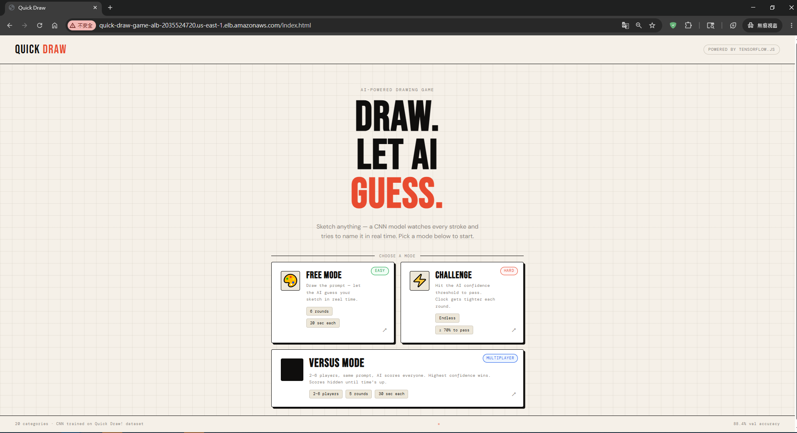

# Quick Draw

A browser-based AI drawing game powered by TensorFlow.js. Draw a sketch and a custom CNN model predicts the category in real time. The project includes single-player modes, challenge gameplay, and real-time multiplayer synchronization through Socket.io.

This repository also includes a production-style AWS ECS Fargate deployment path using Docker, Amazon ECR, Application Load Balancer, CloudWatch Logs, and Terraform.



---

## Demo

The application supports:

- Free Mode: draw freely across timed rounds while the browser-side model predicts your sketch.
- Challenge Mode: pass confidence thresholds under progressively tighter time limits.
- Versus Mode: create multiplayer rooms, synchronize players with Socket.io, and compare AI-scored drawings after each round.

Demo screenshots are stored under:

```text
docs/assets/
```

Example validation screenshots include:

```text
docs/assets/homepage-alb.png
docs/assets/free-mode-inference.png
docs/assets/challenge-mode-ongoing.png
docs/assets/versus-lobby.png
docs/assets/versus-room.png
docs/assets/versus-multiplayer-sync.png
docs/assets/aws-ecs-validation.png
```

---

## Core Features

- Browser-side TensorFlow.js inference
- Custom CNN model trained from Google Quick Draw-style sketch data
- Canvas drawing engine with mouse and touch support
- Free Mode, Challenge Mode, and Versus Mode
- REST APIs for multiplayer lobby and room creation
- Socket.io-based real-time multiplayer synchronization
- Dockerized Node.js / Express application
- Terraform-based AWS ECS Fargate deployment

---

## Tech Stack

| Layer | Technology |
|---|---|
| Frontend | Vanilla HTML / CSS / JavaScript |
| ML Inference | TensorFlow.js 4.x |
| Drawing Engine | HTML Canvas |
| Backend | Node.js + Express |
| Real-time Sync | Socket.io 4.x |
| Model | Custom CNN |
| Containerization | Docker |
| Cloud Runtime | AWS ECS Fargate |
| Image Registry | Amazon ECR |
| Public Entry Point | Application Load Balancer |
| Logs | CloudWatch Logs |
| Infrastructure | Terraform |

The server does not perform ML inference. TensorFlow.js inference runs entirely in the browser, while the backend serves static assets, REST APIs, and Socket.io multiplayer events.

---

## Application Architecture

```text
Browser
  ├── Canvas drawing engine
  ├── TensorFlow.js model inference
  ├── REST API client
  └── Socket.io client
        ↓
Node.js / Express / Socket.io backend
  ├── Static frontend serving
  ├── REST APIs under /api
  ├── Multiplayer room management
  ├── Server-side round coordination
  └── In-memory room and score state
```

Key design point:

```text
The ML model runs in the browser.
The backend coordinates multiplayer state.
```

This keeps inference latency low and avoids backend GPU infrastructure cost.

---

## Runtime Configuration

The frontend uses runtime configuration in:

```text
frontend/js/config.js
```

The project supports three deployment modes without a frontend build step:

| Mode | Frontend Origin | Backend Origin | Use Case |
|---|---|---|---|
| Local development | `http://localhost:3000` | `http://localhost:3000` | Development and debugging |
| Hosted public demo | Vercel | Render | Always-available public demo |
| AWS ECS Fargate | ALB DNS | Same ALB origin | Portfolio cloud deployment demo |

The frontend chooses the backend origin at runtime:

```js
const backendOrigin = isLocalhost
  ? "http://localhost:3000"
  : isVercel
    ? HOSTED_BACKEND_URL
    : origin;
```

This keeps the public hosted demo available while still allowing the same codebase to run behind an AWS Application Load Balancer during ECS Fargate validation.

---

## Deployment Modes

This project intentionally supports two deployment purposes:

### Public live demo

The public demo can run with a hosted frontend and backend:

```text
Vercel frontend → Render backend
```

This mode is useful when AWS infrastructure is not currently running.

### AWS ECS Fargate validation

The AWS deployment is intended for infrastructure demonstration and short-lived validation:

```text
ALB → ECS Fargate task → Node.js / Express / Socket.io container
```

This mode is provisioned with Terraform and destroyed after validation to control cost.

---

## AWS ECS Fargate Deployment

The AWS deployment configuration is located under:

```text
infra/aws-ecs-fargate/
```

The deployment packages the full Node.js / Express / Socket.io application and static TensorFlow.js frontend into a Docker image, pushes the image to Amazon ECR, and runs it as an ECS Fargate service behind an Application Load Balancer.

```text
Internet
  ↓
Application Load Balancer
  ↓
ECS Service
  ↓
Fargate Task
  ↓
Node.js / Express / Socket.io container
  ↓
Static frontend + TensorFlow.js model
```

AWS resources provisioned by Terraform include:

- Amazon ECR repository
- ECS cluster
- ECS task definition
- ECS Fargate service
- Application Load Balancer
- Target group and listener
- Security groups
- IAM task execution role
- CloudWatch log group

Full deployment instructions are documented in:

```text
infra/aws-ecs-fargate/README.md
```

---

## Deployment Design Decisions

### Browser-side ML inference

The TensorFlow.js model remains browser-side. ECS Fargate hosts the web application and multiplayer backend, but does not perform GPU inference or Python model serving.

This keeps the cloud runtime lightweight and cost-aware.

### Single ECS task

The ECS service intentionally uses:

```hcl
desired_count = 1
```

The multiplayer room manager stores room state in memory. Running multiple ECS tasks without shared state could split players across different containers.

A horizontally scalable version would require Redis-backed room state, Socket.io Redis adapter, sticky sessions, or another external state synchronization mechanism.

### ALB entry point

The container is not exposed directly to the internet. Public traffic enters through the Application Load Balancer and is forwarded to the ECS task on port 3000.

```text
Browser → ALB:80 → ECS task:3000
```

### Cost-aware demo lifecycle

This deployment is intended for short-lived validation and portfolio demos:

```text
terraform apply
→ build and push Docker image
→ validate ECS / ALB / application behavior
→ terraform destroy
```

This avoids leaving ALB and Fargate resources running unnecessarily.

---

## Validation Summary

The ECS Fargate deployment was validated with:

- Terraform apply completed successfully
- Docker image pushed to Amazon ECR
- ECS service reached steady state
- Target group reported healthy targets
- `/api/health` returned HTTP 200 through the ALB
- Homepage loaded through the ALB DNS name
- Free Mode worked
- Challenge Mode worked
- Versus Mode room creation worked
- Two browser sessions joined the same multiplayer room
- Socket.io multiplayer synchronization worked through the ALB
- Terraform destroy completed successfully after validation

Validation screenshots are stored under:

```text
docs/assets/
```

---

## Local Development

### Prerequisites

- Node.js 18+
- npm

### Install dependencies

```bash
npm install
```

### Start the development server

```bash
npm run dev
```

Open:

```text
http://localhost:3000
```

---

## Docker

Build the application image:

```bash
docker build -t quick-draw-game:latest .
```

Run locally:

```bash
docker run --rm -p 3000:3000 quick-draw-game:latest
```

Open:

```text
http://localhost:3000
```

---

## Project Structure

```text
quickdraw/
├── backend/
│   ├── server.js
│   ├── room-manager.js
│   └── routes/
├── frontend/
│   ├── index.html
│   ├── game.html
│   ├── challenge.html
│   ├── lobby.html
│   ├── room.html
│   ├── game-multi.html
│   ├── css/
│   ├── js/
│   └── assets/
├── infra/
│   └── aws-ecs-fargate/
│       ├── main.tf
│       ├── variables.tf
│       ├── outputs.tf
│       ├── terraform.tfvars.example
│       └── README.md
├── docs/
│   └── assets/
├── scripts/
├── Dockerfile
├── .dockerignore
├── package.json
└── README.md
```

---

## Model

- Custom CNN trained with Python / TensorFlow
- Converted to TensorFlow.js LayersModel
- Served as static frontend assets
- Loaded and executed directly in the browser

The server is not involved in prediction. The browser owns the inference loop.

---

## Multiplayer Architecture

```text
Browser A                    Backend                    Browser B
─────────                    ───────                    ─────────
Join room  ────────────────→ room manager ←──────────── Join room
Draw
Run TF.js inference
Submit score ─────────────→ score state
                              ↓
                         round timer
                              ↓
Round result ←──────────── broadcast ───────────────→ Round result
```

Room state is currently process-local and in memory, which is why the ECS deployment intentionally runs one task.

---

## Interview Framing

This project demonstrates two layers:

1. Application layer:
   - browser-side ML inference
   - Canvas drawing
   - real-time multiplayer
   - REST APIs and Socket.io synchronization

2. Cloud deployment layer:
   - Docker containerization
   - ECR image publishing
   - ECS Fargate managed runtime
   - ALB public routing and health checks
   - CloudWatch logging
   - Terraform Infrastructure-as-Code
   - cost-aware teardown workflow

The ECS Fargate enhancement turns the original local AI drawing game into a reproducible cloud-deployable application without changing the core browser-side ML architecture.

---

## License

MIT
